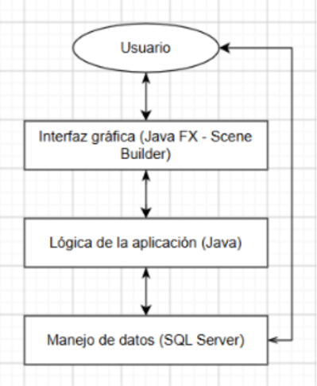
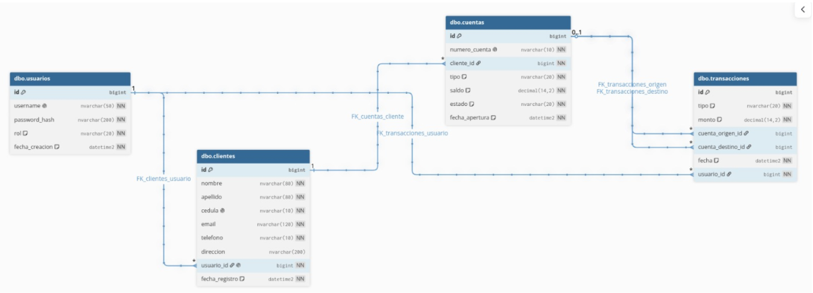
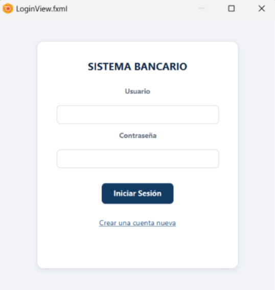
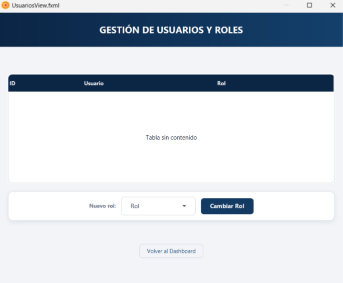
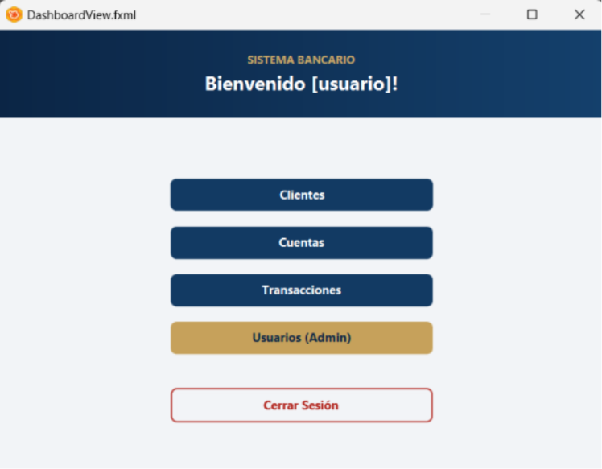
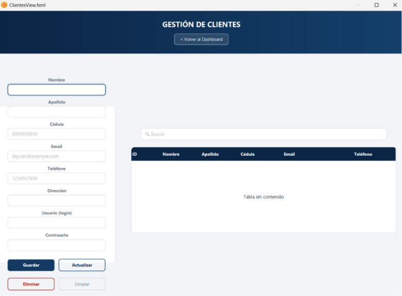
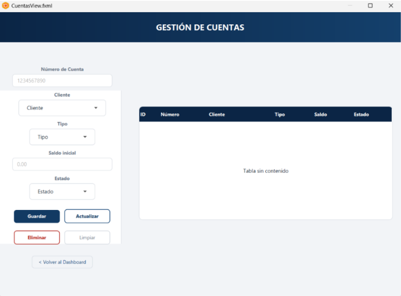
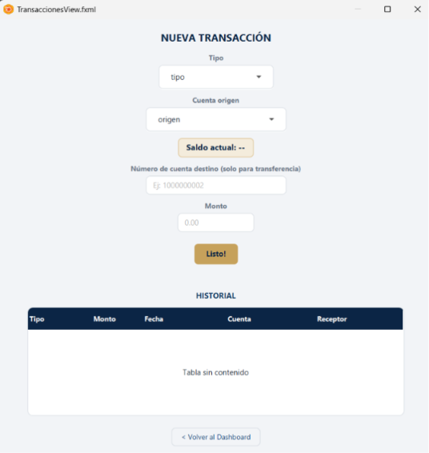

# Sistema Bancario CRUD

Sistema desarrollado en JavaFX para gestionar clientes, cuentas bancarias, usuarios y transacciones financieras mediante operaciones CRUD.

## Descripción del proyecto

El sistema simula la gestión básica de una entidad bancaria. Permite registrar usuarios y clientes, crear cuentas bancarias, consultar saldos, realizar depósitos, retiros y transferencias, además de administrar los roles de acceso.

La aplicación utiliza una arquitectura en capas que separa la interfaz gráfica, la lógica de negocio y el acceso a datos. La comunicación con la base de datos se realiza mediante JDBC y Microsoft SQL Server.

## Objetivo

Desarrollar una aplicación CRUD utilizando Java que permita aplicar conocimientos de programación orientada a objetos, diseño de interfaces gráficas, persistencia de datos, validaciones y separación de responsabilidades mediante una arquitectura por capas.

## Funcionalidades principales

### Autenticación y usuarios

- Inicio de sesión mediante usuario y contraseña
- Registro de nuevos usuarios
- Validación de credenciales
- Cierre de sesión
- Administración de roles
- Restricción de funcionalidades según el rol del usuario

### Gestión de clientes

- Registro, consulta, actualización y eliminación de clientes
- Búsqueda por nombre o cédula

### Gestión de cuentas

- Creación de cuentas bancarias
- Asociación de cuentas con clientes
- Consulta de saldo y estado
- Actualización del tipo o estado de la cuenta
- Eliminación y consulta de cuentas registradas

### Gestión de transacciones

- Transferencias entre cuentas
- Validación de montos y saldos disponibles
- Verificación del estado de las cuentas
- Actualización automática de saldos
- Registro del historial de movimientos

### Roles del sistema

- **Administrador:** administra clientes, cuentas y usuarios, y consulta el historial de transacciones.
- **Cliente:** consulta la información disponible y realiza depósitos, retiros y transferencias desde sus cuentas asociadas.

## Tecnologías utilizadas

- Java 17 o superior
- JavaFX
- FXML
- Scene Builder
- Microsoft SQL Server
- JDBC
- Maven
- jBCrypt para el manejo de contraseñas (Hash)
- CSS para la personalización

## Requisitos previos

- JDK 17 o superior
- Maven
- SQL Server Management Studio
- Sistema operativo Windows 10 o superior, o Linux con soporte gráfico

## Instalación y configuración

### 1. Descargar el proyecto

Clonar el repositorio y acceder a su carpeta:

```bash
git clone https://github.com/DrosherJC/sistema-bancario
cd sistema-bancario
```

> También es posible descargar el proyecto como archivo ZIP y descomprimirlo localmente

### 2. Configurar la base de datos

1. Iniciar el servicio de Microsoft SQL Server
2. Crear la base de datos del proyecto
3. Ejecutar el script SQL de creación de tablas, relaciones e información inicial
4. Comprobar que las tablas principales se hayan creado correctamente

### 3. Configurar la conexión

Actualizar la configuración de conexión con los valores del entorno local:

- Servidor y puerto
- Nombre de la base de datos
- Usuario de SQL Server
- Contraseña
- Tipo de autenticación

Ejemplo:

```java
String url = "jdbc:sqlserver://localhost:1433;databaseName=nombre_base_datos";
String usuario = "usuario_sql";
String contrasena = "contrasena_sql";
```

No se deben publicar credenciales reales dentro del repositorio. Para entornos productivos se recomienda utilizar variables de entorno o un archivo de configuración externo.

## Cómo ejecutar el proyecto

Desde la carpeta principal del proyecto, ejecutar:

```bash
mvn clean javafx:run
```

*También puede ejecutarse desde el IDE utilizando la clase principal de la aplicación.*

Antes de iniciar el sistema, verificar que:

1. SQL Server esté activo
2. La base de datos exista
3. La configuración de conexión sea correcta
4. Las dependencias de Maven se hayan descargado correctamente

## Flujo general de uso

1. Ingresar al sistema desde la pantalla de inicio de sesión
2. Registrar una cuenta nueva si el usuario aún no existe
3. Iniciar sesión con las credenciales registradas
4. Acceder al Dashboard
5. Seleccionar el módulo que se desea utilizar
6. Realizar las operaciones permitidas según el rol
7. Regresar al Dashboard o **cerrar sesión**

## Estructura del proyecto

La aplicación se organiza en paquetes siguiendo una arquitectura en capas

```text
C:.
└───main
    ├───java
    │   └───com
    │       └───example
    │           └───frontend
    │               │   ClientesController.java
    │               │   CuentasController.java
    │               │   DashboardController.java
    │               │   Launcher.java
    │               │   LoginController.java
    │               │   MainApp.java
    │               │   RegisterController.java
    │               │   TransaccionesController.java
    │               │   UsuariosController.java
    │               │
    │               ├───dao
    │               │       ClienteDAO.java
    │               │       CuentaDAO.java
    │               │       TransaccionDAO.java
    │               │       UsuarioDAO.java
    │               │
    │               ├───model
    │               │       Cliente.java
    │               │       Cuenta.java
    │               │       EstadoCuenta.java
    │               │       Rol.java
    │               │       TipoCuenta.java
    │               │       TipoTransaccion.java
    │               │       Transaccion.java
    │               │       Usuario.java
    │               │
    │               ├───service
    │               │       AuthService.java
    │               │       ClienteService.java
    │               │       CuentaService.java
    │               │       TransaccionService.java
    │               │       UsuarioService.java
    │               │
    │               └───util
    │                       ConexionBD.java
    │                       Dialogos.java
    │                       LimitadorCampos.java
    │                       Navegador.java
    │                       PasswordUtil.java
    │                       Sesion.java
    │
    └───resources
        │   db.properties
        │
        └───com
            └───example
                └───frontend
                        .gitkeep
                        ClientesView.fxml
                        CuentasView.fxml
                        DashboardView.fxml
                        LoginView.fxml
                        RegisterView.fxml
                        styles.css
                        TransaccionesView.fxml
                        UsuariosView.fxml
```

> La ubicación exacta de algunos archivos puede variar según la organización final del proyecto.

## Arquitectura del sistema

El proyecto utiliza una arquitectura en capas con principios de MVC:



### Capas principales

- **Vista:** archivos FXML y hoja de estilos CSS.
- **Controlador:** recibe las acciones realizadas desde la interfaz.
- **Modelo:** representa las entidades y enumeraciones del sistema.
- **Servicio:** contiene las reglas de negocio y validaciones.
- **DAO:** ejecuta las consultas SQL y transforma los resultados en objetos.
- **Utilidades:** incluye la conexión a la base de datos, navegación, sesión y diálogos.

## Base de datos

La aplicación utiliza Microsoft SQL Server como sistema gestor de base de datos.

### Tablas principales

- `usuarios`
- `clientes`
- `cuentas`
- `transacciones`

### Relaciones principales

- Un usuario puede estar asociado con un cliente
- Un cliente puede tener una o varias cuentas
- Una cuenta puede participar en varias transacciones
- Una transacción puede relacionar una cuenta de origen y una cuenta destino
- Cada transacción queda asociada al usuario que la ejecutó



Las operaciones de depósito, retiro y transferencia deben ejecutarse de forma consistente. Para ello, la capa de servicios utiliza transacciones SQL con confirmación o reversión de cambios mediante `commit` y `rollback`.

## Capturas de las interfaces

Esta sección se incluye para documentar visualmente las vistas principales de la aplicación.

### Inicio de sesión

Pantalla destinada a la autenticación de los usuarios mediante sus credenciales.



### Registro de usuarios

Formulario para registrar un nuevo usuario y sus datos personales.



### Dashboard

Panel principal con accesos a los diferentes módulos del sistema.



### Gestión de clientes

Vista para consultar y administrar la información de los clientes.



### Gestión de cuentas

Vista para crear, consultar, actualizar y eliminar cuentas bancarias.



### Gestión de transacciones

Vista para realizar operaciones financieras y consultar el historial de movimientos.



### Administración de usuarios

Vista exclusiva para administradores, utilizada para consultar usuarios y modificar sus roles.


## Validaciones y mensajes de error — Sistema Bancario

## Login / Registro

| Mensaje                                                    | Clase de origen      | Cuándo se dispara                                    |
|------------------------------------------------------------|----------------------|------------------------------------------------------|
| Usuario o contraseña incorrectos                           | `AuthService`        | Login: username no existe o password no coincide     |
| Ese nombre de usuario no esta disponible, intenta con otro | `AuthService`        | Registro: el username ya existe                      |
| El usuario es obligatorio                                  | `AuthService`        | Registro: username vacío/en blanco                   |
| La contraseña debe tener al menos 6 caracteres             | `AuthService`        | Registro: password muy corta                         |
| El nombre es obligatorio                                   | `ClienteService`     | Registro: nombre del cliente vacío                   |
| El apellido es obligatorio                                 | `ClienteService`     | Registro: apellido del cliente vacío                 |
| La cedula debe tener 10 digitos numericos                  | `ClienteService`     | Registro: cédula inválida                            |
| El email debe contener una arroba (@)                      | `ClienteService`     | Registro: email inválido                             |
| El telefono debe tener exactamente 10 digitos              | `ClienteService`     | Registro: teléfono inválido                          |
| Las contraseñas no coinciden                               | `RegisterController` | Registro: password ≠ confirmación (validación de UI) |
| Usuario y contraseña son obligatorios                      | `LoginController`    | Login: campos vacíos                                 |

## Transacciones

| Mensaje                                           | Clase de origen           | Cuándo se dispara                             |
|---------------------------------------------------|---------------------------|-----------------------------------------------|
| El monto debe ser mayor a cero                    | `TransaccionService`      | Monto nulo o ≤ 0                              |
| Saldo insuficiente. Disponible: X                 | `TransaccionService`      | Retiro/transferencia sin fondos suficientes   |
| La cuenta no existe                               | `TransaccionService`      | Cuenta origen/destino no encontrada           |
| La cuenta [numero] esta inactiva                  | `TransaccionService`      | Cuenta con estado `INACTIVA`                  |
| La cuenta origen y destino no pueden ser la misma | `TransaccionService`      | Transferencia a la misma cuenta               |
| Selecciona el tipo de transaccion                 | `TransaccionesController` | No se eligió tipo en el combo                 |
| El monto debe ser un numero valido                | `TransaccionesController` | Texto del monto no parsea a `BigDecimal`      |
| Escribe el numero de cuenta destino               | `TransaccionesController` | Campo de cuenta destino vacío (transferencia) |
| No existe ninguna cuenta con el numero X          | `TransaccionesController` | Número de cuenta destino no encontrado        |
| Selecciona la cuenta [origen / a depositar]       | `TransaccionesController` | No se eligió cuenta origen                    |

## Cuentas

| Mensaje                                                                    | Clase de origen     | Cuándo se dispara                       |
|----------------------------------------------------------------------------|---------------------|-----------------------------------------|
| El cliente seleccionado no existe                                          | `CuentaService`     | Cliente inválido al abrir cuenta        |
| El numero de cuenta debe tener exactamente 10 digitos                      | `CuentaService`     | Número de cuenta inválido               |
| Debe seleccionar un cliente                                                | `CuentaService`     | Falta cliente al crear cuenta           |
| Debe seleccionar el tipo de cuenta                                         | `CuentaService`     | Falta tipo de cuenta                    |
| El saldo debe ser un numero valido                                         | `CuentasController` | Texto del saldo no parsea a número      |
| No se pudo eliminar: la cuenta probablemente tiene transacciones asociadas | `CuentasController` | Error de BD al eliminar (llave foránea) |

## Usuarios

| Mensaje                                           | Clase de origen      | Cuándo se dispara            |
|---------------------------------------------------|----------------------|------------------------------|
| Solo un administrador puede cambiar roles         | `UsuarioService`     | Actor sin permiso de admin   |
| No puedes quitarte tu propio rol de administrador | `UsuarioService`     | Admin intenta autodegradarse |
| Selecciona un usuario de la tabla primero         | `UsuariosController` | No hay fila seleccionada     |
| Selecciona el nuevo rol                           | `UsuariosController` | No se eligió rol en el combo |

## Genéricos (errores técnicos de base de datos)

| Mensaje                                                                    | Dónde aparece                                                                            |
|----------------------------------------------------------------------------|------------------------------------------------------------------------------------------|
| Error de conexion a la base de datos                                       | `LoginController`, `RegisterController`, `UsuariosController`, `TransaccionesController` |
| No se pudo cargar la lista de clientes / cuentas / usuarios / el historial | Distintos controllers, al fallar una consulta de solo lectura                            |
| Error de base de datos al guardar/actualizar el cliente/la cuenta          | `ClientesController`, `CuentasController`                                                |
| No se pudo eliminar: el cliente probablemente tiene cuentas asociadas      | `ClientesController`                                                                     |

**Nota general:** los errores de validación de negocio (`IllegalArgumentException`, `SecurityException` y las excepciones propias de `AuthService`) se muestran al usuario con su mensaje exacto, porque son errores esperables. Los `SQLException` (fallas técnicas de conexión/consulta) siempre se ocultan detrás de un mensaje genérico y se registran con `printStackTrace()` para no exponer detalles internos al usuario final.

## Mantenimiento y actualización

Para mantener el sistema en buenas condiciones se recomienda:

- Respaldar la base de datos
- Verificar el estado del servicio de `SQL Server`
- Actualizar `Java` y las dependencias del proyecto
- Revisar consultas SQL lentas
- Eliminar código no utilizado (optimizar)
- Mantener separadas las responsabilidades de cada capa
- Ejecutar pruebas después de modificar la lógica 
- Utilizar `Git` para controlar las versiones del proyecto

## Autores

- José Eduardo Buñay Cóndor
- Danna Mical Moreno Jácome
- Alan Javier Reyes Casierra

## Información académica

- **Institución:** Escuela Politécnica Nacional - Escuela de Formación de Tecnólogos (ESFOT)
- **Carrera:** Desarrollo de Software
- **Asignatura:** Programación Orientada a Objetos (POO)
- **Profesor:** Ing. Sergio Granizo MSc.
- **Período académico:** 2026-A
